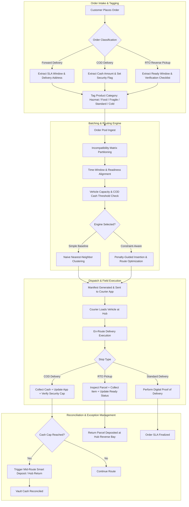

# Operational Field-Workflow Map: COD & RTO Constraint-Aware Logistics

## 1. Executive Summary & Operational Context
In high-velocity parcel logistics, Cash-on-Delivery (COD) and Return-to-Origin (RTO) operations represent two of the most complex, cost-sensitive fulfillment channels. 
- **COD Shipments**: Require strict physical cash collection at customer doorsteps. Unplanned accumulation of cash creates severe courier safety risks, cash-in-transit (CIT) insurance breaches, and reconciliation friction.
- **RTO Shipments**: Represent reverse logistics flows where couriers retrieve items from customers. They depend on customer availability, item inspection/readiness windows, and real-time inventory tagging.
- **Product Incompatibilities**: Hazardous items (e.g. lithium batteries, cleaning chemicals) cannot share vehicle space with food/perishables or fragile high-value electronics.
- **Promised Delivery Windows (SLAs)**: Time-sensitive express parcels require strict delivery windows (e.g. 2-hour or same-day SLAs).

This operational workflow map outlines the end-to-end lifecycle of an order from intake to final vault deposit and reverse logistics processing.

---

## 2. End-to-End Operational Lifecycle (Diagram)

---

## 3. Detailed Stage Breakdowns

### Stage 1: Order Intake & Constraint Tagging
- **Input Payload**: Order ID, Customer Geo-location $(lat, lng)$, SLA Window $[TW_{start}, TW_{end}]$, COD Amount ($), RTO Status, Item Category, Parcel Mass (kg), Parcel Volume (m³).
- **Automation Rule**:
  - If `ProductCategory == Hazmat`, tag as `ISOLATED_HAZMAT`.
  - If `ProductCategory == Food` or `ColdChain`, tag as `ISOLATED_PERISHABLE`.
  - If `COD_Amount > $0`, add to rider running cash counter.
  - If `IsRTO == True`, gate stop arrival time until $Time \ge R_{ready\_time}$.

### Stage 2: Constraint-Aware Batching & Routing Engine
- **Step 2.1**: Partition the order pool into mutually compatible product buckets ($S_{hazmat}, S_{food}, S_{general}$).
- **Step 2.2**: Form initial time-window clusters within each bucket.
- **Step 2.3**: Execute parallel insertion heuristic:
  - Subject to: $\sum_{i \in Route} Weight_i \le Cap_{weight}$
  - Subject to: $\sum_{i \in Route} Volume_i \le Cap_{volume}$
  - Subject to: $\sum_{i \in Route, COD} Cash_i \le Cap_{cash}$ (e.g. $1,000 max)
  - Subject to: $Arrival_i \le TW_{end, i}$ (Minimize late delivery penalty)

### Stage 3: Field Courier Execution & Mobile Workflow
- **Digital Manifest**: Courier receives ordered stop sequence with route polylines and stop badges.
- **COD Security Alert**: When accumulated cash reaches 80% of limit ($800), mobile app issues a warning badge. At 100% ($1,000), further cash deliveries block unless authorized or routed to mid-route deposit point.
- **RTO Verification Checklist**: For return pickups, courier executes mandatory 3-point check (Barcode scan, Visual inspection, OTP confirmation).

### Stage 4: Vault Deposit & Reverse Logistics Reconciliation
- **Hub Vault Handshake**: At shift conclusion (or mid-route cash drop), cash collected is verified against digital app tallies.
- **RTO Staging**: Reverse parcels are transferred to the RTO inspection bay for warehouse re-stocking or seller dispatch.

---

## 4. Key Performance Indicators (KPIs)
- **Distance Saved Rate (%)**: Difference in total km traveled vs naive baseline.
- **SLA On-Time Compliance (%)**: Percentage of deliveries completed before $TW_{end}$.
- **Cash Security Violation Count**: Number of routes exceeding maximum cash carrying threshold.
- **Product Contamination Rate**: Number of illegal co-loads of Hazmat with Perishable/Food products.
- **CO2 Emissions Reduction (kg)**: Calculated as $\Delta km \times 0.211 \text{ kg CO2/km}$.
